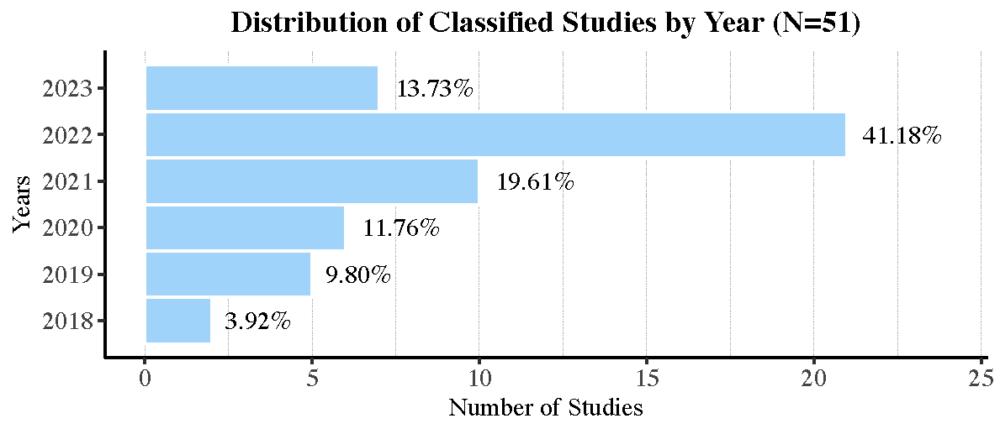
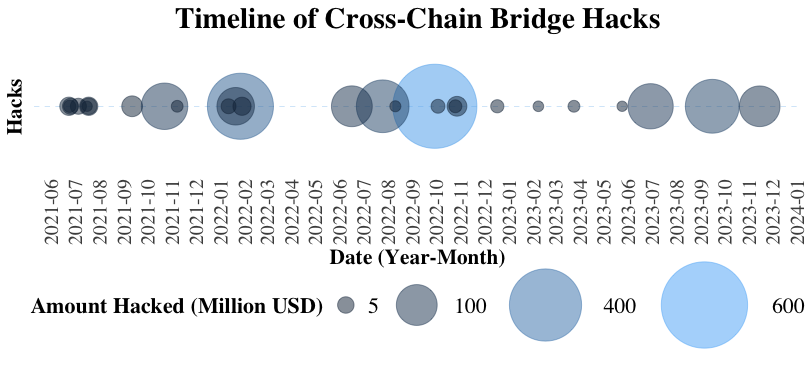
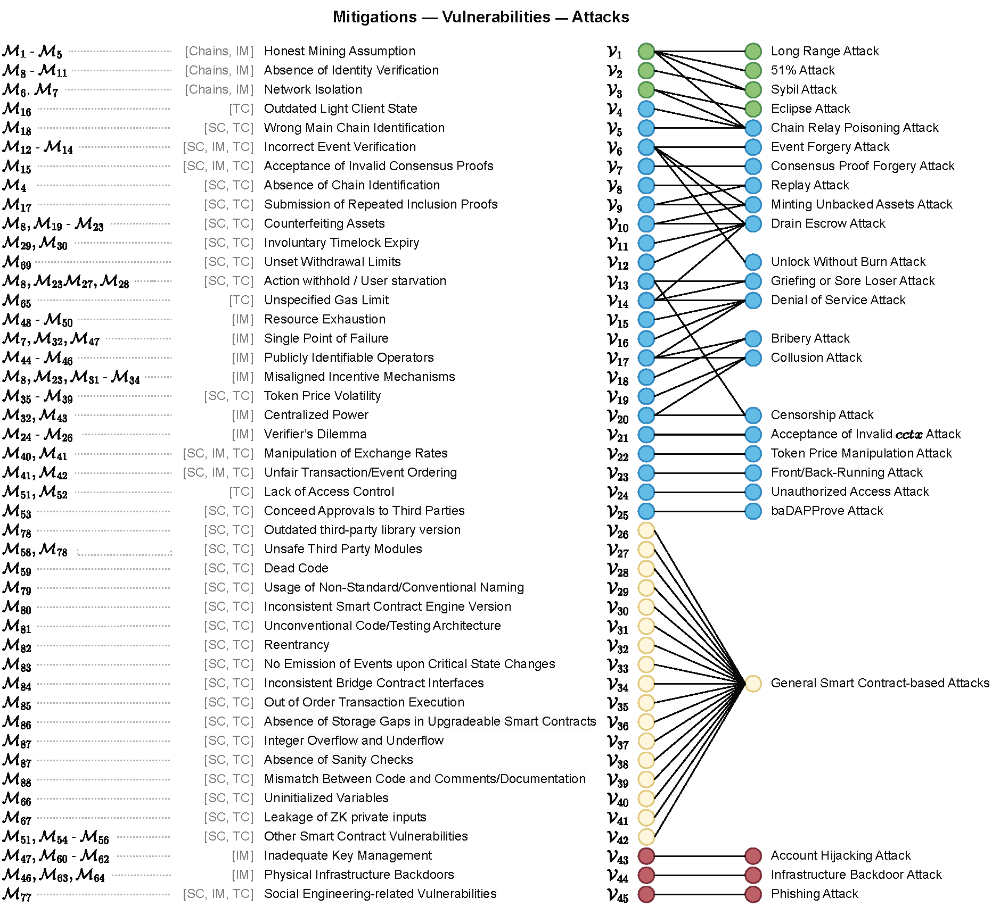

# Supplementary Materials for: "SoK: Security and Privacy of Blockchain Interoperability"

- [bridge_hacks](#bridge_hacks) - This section provides detailed tables and information regarding various hacked bridges in the blockchain domain, including Ethereum and Binance Smart Chain transactions.
- [code](#code) - Contains scripts and Jupyter notebooks essential for analyzing security incidents and research trends in blockchain security. This includes the comprehensive "SoKI.ipynb" notebook and R scripts for distribution studies and timeline analysis.

- [data](#data) - A repository of pivotal data files such as "all_bridge_hacks.csv" for security breaches across blockchain bridges and "list_classified_papers.csv" for a compilation of academic papers on cross-chain transactions.

- [papers](#papers) - A repository of blockchain interoperability papers that consider security and/or privacy.

- [figures](#figures) - Hosts key visual representations related to blockchain security, including graphs and timelines that offer insights into the evolution and impact of security incidents in the blockchain domain.

## bridge_hacks

  

    This folder features two tables under "Incidence Response" and "The Hashes of Transactions and Addresses." The "Incidence Response" table offers an overview of various hacked bridges, highlighting initial transactions and public announcements. Names are color-coded, with Ethereum (ETH) and Binance Smart Chain (BSC) transaction details partly shown. The second table delves deeper, presenting complete transaction hashes and additional data, including Ethereum, Polygon, and BSC transactions, attacker addresses, and informative links. For full incident details, consult the <code>incident_response.md</code> and <code>txs_and_addresses_hashes.md</code> files.
  

## code

This `code` folder contains scripts and notebooks instrumental in understanding security incidents and academic research trends in the blockchain domain. The Jupyter notebook, "SoKI.ipynb," encompasses the content and analyses from the two R scripts, "distribution_studies_by_year.R" and "hacks_timeline.R," providing a unified, interactive platform for exploring blockchain security incidents and research trends.

## data

The `data` folder on GitHub is a comprehensive resource for those interested in blockchain security and cross-chain transactions. It houses two pivotal data files:

1. **all_bridge_hacks.csv**: This file chronicles significant security breaches across various blockchain bridges. It details the date and monetary impact of each incident, serving as an invaluable asset for analyzing trends and understanding the extent of such security issues in the blockchain realm.

2. **list_classified_papers.csv**: Aimed at academics and researchers, this file compiles a list of scholarly articles focused on cross-chain transactions. These papers are sorted by title, publication year, interoperability mode, and their application in private blockchain environments. This compilation is an essential tool for those researching the evolving field of blockchain interoperability and privacy.

These files are instrumental for professionals, researchers, and enthusiasts in the blockchain security domain, offering a blend of practical data and academic insights to foster a deeper understanding of blockchain vulnerabilities and advancements.

## papers
Here, we have a list of work done in the area of interoperability security and interoperability privacy. 

| Ref | Year | Security Approaches | Privacy Approaches | IMode |
|---|:---:|:---:|:---:|:---:|
| Scheid_Hegnauer_Rodrigues_Stiller_2019 | 2019 | Centralization | -- | DT |
| shlomovits_jugglingswap_2020 | 2020 | Centralization | -- | AE |
| patel_crosstrustchain_2023 | 2023 | Centralization | -- | DT |
| zhang_pxcrypto_2023 | 2023 | Centralization | -- | AE |
| Vishwakarma_Kumar_Das_2023 | 2023 | Centralization | -- | AT |
| lan_trustcross_2021 | 2021 | Centralization, TEE | Zero-Knowledge Proofs | DT |
| zhang_arc_2022 | 2022 | Centralization, Permissionless Network | -- | DT |
| Ghaemi_Rouhani_Belchior_Cruz_Khazaei_Musilek_2021 | 2021 | Centralization, Permissionless Network,  Permissioned Network | -- | DT |
| belchior_hermes_2022 | 2022 | Centralization,  Permissioned Network, Inclusion Proofs | TEE | AT |
| abebe_enterprise_2019 | 2019 | Centralization,  Inclusion Proofs | -- | DT |
| Tao_Li_Li_2023 | 2023 | Centralization, Inclusion Proofs | -- | AT |
| Dai_Jiang_Zhu_Lu_Li_Li_2020 | 2020 | Centralization, Secret-based and Time-based Locks | -- | AE |
| xu_ivycross_2021 | 2021 | TEE | TEE | DT |
| bentov_tesseract_2019 | 2019 | TEE | -- | AE |
| wang_intertrust_2021 | 2021 | TEE | -- | AE |
| yin_bool_2022 | 2022 | TEE, Permissionless Network | Ring Signatures | AT |
| montiel_surfermonkey_2022 | 2022 | Permissionless Network | Zero-Knowledge Proofs | DT |
| sanchez_bridging_2022 | 2022 | Permissionless Network, Inclusion Proofs, Validity Proofs | Zero-Knowledge Proofs | AT |
| li_zerocross_2022 | 2023 | Permissionless Network, Validity Proofs | Zero-Knowledge Proofs | AE |
| zamyatin_xclaim_2019 | 2019 | Permissionless Network, Inclusion Proofs, Validity Proofs | -- | AT |
| zakhary_atomic_2020 | 2020 | Permissionless Network, Secret-based and Time-based Locks | -- | AE |
| liu_hyperservice_2019 | 2019 | Permissioned Network | -- | DT |
| sober_voting_based_2021 | 2021 | Permissioned Network | -- | DT |
| tian_enabling_2021 | 2021 | Permissioned Network | -- | AE |
| pang_abitbridge_2022 | 2022 | Permissioned Network | -- | AT |
| yang_anonymous_2023 | 2023 | Permissioned Network | Zero-Knowledge Proofs | AT |
| ghosh_leveraging_2021 | 2021 | Permissioned Network, Inclusion Proofs | -- | DT |
| westerkamp_zkrelay_2020 | 2020 | Permissioned Network, Validity Proofs | -- | DT |
| sun_decentralized_2022 | 2022 | Permissioned Network, Secret-based and Time-based Locks | -- | AE |
| barbara_bxtb_2022 | 2022 | Inclusion Proofs | -- | AE |
| westerkamp_verilay_2022 | 2022 | Inclusion Proofs | -- | DT |
| stone2023webb | 2023 | Inclusion Proofs, Validity Proofs | Zero-Knowledge Proofs | AT |
| xie_zkbridge_2022 | 2022 | Inclusion Proofs, Validity Proofs | -- | AT |
| Li_D_Angelo_Tang_Fang_Gong_2022 | 2022 | Inclusion Proofs, Validity Proofs | Zero-Knowledge Proofs | AT |
| frauenthaler_eth_2020 | 2020 | Inclusion Proofs, Fraud Proofs | -- | DT |
| xue_hedging_2021 | 2021 | Secret-based and Time-based Locks | -- | AE |
| narayanam_atomic_2022 | 2022 | Secret-based and Time-based Locks | -- | AE |
| tsabary_mad_htlc_2021 | 2021 | Secret-based and Time-based Locks | -- | AE |
| cai_ptlc_2022 | 2022 | Secret-based and Time-based Locks | Homomorphic Encryption | AE |
| herlihy_atomic_2018 | 2018 | Secret-based and Time-based Locks | -- | AE |
| mazumdar_towards_2022 | 2022 | Secret-based and Time-based Locks | -- | AE |
| ding_lilac_2022 | 2022 | Secret-based and Time-based Locks | -- | AE |
| bugnet_xcc_2022 | 2022 | Secret-based and Time-based Locks | -- | AE |
| deshpande_privacy_preserving_2020 | 2020 | Secret-based and Time-based Locks | Adaptor Signatures | AE |
| kirsten_anonymous_2018 | 2018 | Secret-based and Time-based Locks | Homomorphic Encryption | AE |
| zhang_privacy_preserving_2021 | 2021 | Secret-based and Time-based Locks | Zero-Knowledge Proofs | AE |
| manevich_cross_2022 | 2022 | Secret-based and Time-based Locks | -- | AE |
| li_privacy_preserving_2022 | 2022 | Secret-based and Time-based Locks | Adaptor Signatures | AE |
| hanzlik_sweep_uc_2022 | 2022 | Secret-based and Time-based Locks | Blind Signatures | AE |
| thyagarajan_universal_2021 | 2021 | Secret-based and Time-based Locks | -- | AE |
| Polygon_Wiki | 2023 | Centralization, Permissioned Network | -- | AT |
| optimism_bridging_basics | 2023 | Centralization, Permissioned Network, Fraud Proofs | -- | AT |
| arbitrum_bridging_tokens_2023 | 2023 | Centralization, Permissioned Network, Fraud Proofs | -- | AT |
| Ronin_Docs_2023 | 2022 | Centralization, Permissioned Network | -- | AT |
| zksync_bridging | 2023 | Permissioned Network, Validity Proofs | -- | DT |
| connext | 2023 | Fraud Proofs | -- | AT |

## figures

  

This folder contains key visual representations related to blockchain security. It includes 'Papers Years Distribution', 'Timeline of Cross-Chain Hacks', and 'Vulnerability-Attack-Mitigation Graph', each offering insightful data visualization crucial for understanding the evolution and impact of security incidents in the blockchain domain.
  

  

    <h3>Figure 1: Papers Years Distribution</h3>
    
  

  

    <h3>Figure 2: Timeline of Cross-Chain Hacks</h3>
    
  

  

    <h3>Figure 3: Vulnerability-Attack-Mitigation Graph</h3>
    
  

