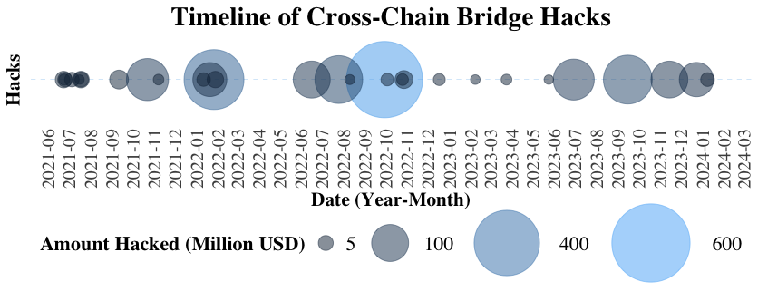

# Supplementary Materials for: "SoK: Security and Privacy of Blockchain Interoperability"

## bridge_hacks

  

    This folder features two tables under "Incidence Response" and "The Hashes of Transactions and Addresses." The "Incidence Response" table offers an overview of various hacked bridges, highlighting initial transactions and public announcements. Names are color-coded, with Ethereum (ETH) and Binance Smart Chain (BSC) transaction details partly shown. The second table delves deeper, presenting complete transaction hashes and additional data, including Ethereum, Polygon, and BSC transactions, attacker addresses, and informative links. For full incident details, consult the <code>incident_response.md</code> and <code>txs_and_addresses_hashes.md</code> files.
  

## code

This `code` folder contains scripts and notebooks instrumental in understanding security incidents and academic research trends in the blockchain domain. The Jupyter notebook, "SoKI.ipynb," encompasses the content and analyses from the two R scripts, "distribution_studies_by_year.R" and "hacks_timeline.R," providing a unified, interactive platform for exploring blockchain security incidents and research trends.

## data

The `data` folder on GitHub is a comprehensive resource for those interested in blockchain security and cross-chain transactions. It houses two pivotal data files:

1. **all_bridge_hacks.csv**: This file chronicles significant security breaches across various blockchain bridges. It details the date and monetary impact of each incident, serving as an invaluable asset for analyzing trends and understanding the extent of such security issues in the blockchain realm.

2. **list_classified_papers.csv**: Aimed at academics and researchers, this file compiles a list of scholarly articles focused on cross-chain transactions. These papers are sorted by title, publication year, interoperability mode, and their application in private blockchain environments. This compilation is an essential tool for those researching the evolving field of blockchain interoperability and privacy.

These files are instrumental for professionals, researchers, and enthusiasts in the blockchain security domain, offering a blend of practical data and academic insights to foster a deeper understanding of blockchain vulnerabilities and advancements.

## figures

  

This folder contains key visual representations related to blockchain security. It includes 'Papers Years Distribution', 'Timeline of Cross-Chain Hacks', and 'Vulnerability-Attack-Mitigation Graph', each offering insightful data visualization crucial for understanding the evolution and impact of security incidents in the blockchain domain.
  

  

    <h3>Figure 1: Papers Years Distribution</h3>
    
  

  

    <h3>Figure 2: Timeline of Cross-Chain Hacks</h3>
    
  

  

    <h3>Figure 3: Vulnerability-Attack-Mitigation Graph</h3>
    
  

