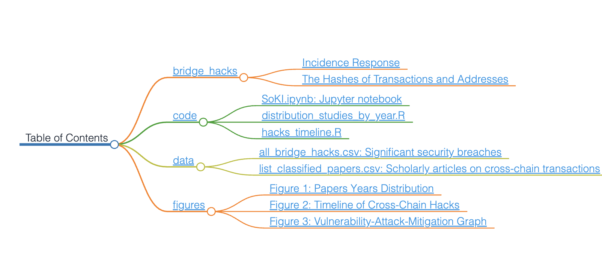

# SoK: Security and Privacy of Blockchain Interoperability

Read the extended version of our paper [here](https://www.techrxiv.org/articles/preprint/SoK_Security_and_Privacy_of_Blockchain_Interoperability/24595764)

## Supplementary Materials

- [bridge_hacks](#bridge_hacks) - This section provides detailed tables and information regarding various hacked bridges in the blockchain domain, including Ethereum and Binance Smart Chain transactions.
- [code](#code) - Contains scripts and Jupyter notebooks essential for analyzing security incidents and research trends in blockchain security. This includes the comprehensive "SoKI.ipynb" notebook and R scripts for distribution studies and timeline analysis.

- [data](#data) - A repository of pivotal data files such as "all_bridge_hacks.csv" for security breaches across blockchain bridges and "list_classified_papers.csv" for a compilation of academic papers on cross-chain transactions.

- [papers](#papers) - A repository of blockchain interoperability papers that consider security and/or privacy.

- [figures](#figures) - Hosts key visual representations related to blockchain security, including graphs and timelines that offer insights into the evolution and impact of security incidents in the blockchain domain.

## bridge_hacks

  

    This folder features two tables under "Incidence Response" and "The Hashes of Transactions and Addresses." The "Incidence Response" table offers an overview of various hacked bridges, highlighting initial transactions and public announcements. Names are color-coded, with Ethereum (ETH) and Binance Smart Chain (BSC) transaction details partly shown. The second table delves deeper, presenting complete transaction hashes and additional data, including Ethereum, Polygon, and BSC transactions, attacker addresses, and informative links. For full incident details, consult the <code>incident_response.md</code> and <code>txs_and_addresses_hashes.md</code> files.
  

## code

This `code` folder contains scripts and notebooks instrumental in understanding security incidents and academic research trends in the blockchain domain. The Jupyter notebook, "SoKI.ipynb," encompasses the content and analyses from the two R scripts, "distribution_studies_by_year.R" and "hacks_timeline.R," providing a unified, interactive platform for exploring blockchain security incidents and research trends.

## data

The `data` folder on GitHub is a comprehensive resource for those interested in blockchain security and cross-chain transactions. It houses two pivotal data files:

1. **all_bridge_hacks.csv**: This file chronicles significant security breaches across various blockchain bridges. It details the date and monetary impact of each incident, serving as an invaluable asset for analyzing trends and understanding the extent of such security issues in the blockchain realm.

2. **list_classified_papers.csv**: Aimed at academics and researchers, this file compiles a list of scholarly articles focused on cross-chain transactions. These papers are sorted by title, publication year, interoperability mode, and their application in private blockchain environments. This compilation is an essential tool for those researching the evolving field of blockchain interoperability and privacy.

These files are instrumental for professionals, researchers, and enthusiasts in the blockchain security domain, offering a blend of practical data and academic insights to foster a deeper understanding of blockchain vulnerabilities and advancements.

## papers
Here, we have a list of work done in the area of interoperability security and interoperability privacy. Please add your paper to this list via a pull request.

| Ref | Year | Security Approaches | Privacy Approaches |
|---|:---:|:---:|:---:|
| Bifröst: a Modular Blockchain Interoperability API | 2019 | Centralization | -- |
| JugglingSwap: Scriptless Atomic Cross-Chain Swaps | 2020 | Centralization | -- |
| CrossTrustchain: Cross-Chain Interoperability using Multivariate Trust Models | 2023 | Centralization | -- |
| PXCrypto: A Regulated Privacy-Preserving Cross-Chain Transaction Scheme | 2023 | Centralization | -- |
| CrossLedger: A Pioneer Cross-chain Asset Transfer Protocol | 2023 | Centralization | -- |
| TrustCross: Enabling Confidential Interoperability across Blockchains Using Trusted Hardware | 2021 | Centralization, TEE | Zero-Knowledge Proofs |
| ARC: An Asynchronous Consensus and Relay Chain-based Cross-chain Solution to Consortium Blockchain | 2022 | Centralization, Permissionless Network | -- |
| A Pub-Sub Architecture to Promote Blockchain Interoperability | 2021 | Centralization, Permissionless Network,  Permissioned Network | -- |
| HERMES: Fault-Tolerant Middleware for Blockchain Interoperability | 2022 | Centralization,  Permissioned Network, Inclusion Proofs | TEE |
| Enabling Enterprise Blockchain Interoperability with Trusted Data Transfer (Industry Track) | 2019 | Centralization,  Inclusion Proofs | -- |
| On Atomicity and Confidentiality Across Blockchains Under Failure | 2023 | Centralization, Inclusion Proofs | -- |
| Research and Implementation of Cross-Chain Transaction Model Based on Improved Hash-Locking | 2020 | Centralization, Secret-based and Time-based Locks | -- |
| IvyCross: A Privacy-Preserving and Concurrency Control Framework for Blockchain Interoperability | 2021 | TEE | TEE |
| Tesseract: Real-Time Cryptocurrency Exchange Using Trusted Hardware | 2019 | TEE | -- |
| InterTrust: Towards an Efficient Blockchain Interoperability Architecture with Trusted Services | 2021 | TEE | -- |
| Bool Network: An Open, Distributed, Secure Cross-chain Notary Platform | 2022 | TEE, Permissionless Network | Ring Signatures |
| SurferMonkey: A Decentralized Anonymous Blockchain Intercommunication System via Zero Knowledge Proofs | 2022 | Permissionless Network | Zero-Knowledge Proofs |
| Bridging Sapling: Private Cross-Chain Transfers | 2022 | Permissionless Network, Inclusion Proofs, Validity Proofs | Zero-Knowledge Proofs |
| ZeroCross: A sidechain-based privacy-preserving Cross-chain solution for Monero | 2023 | Permissionless Network, Validity Proofs | Zero-Knowledge Proofs |
| Xclaim: Trustless, interoperable, cryptocurrency-backed assets | 2019 | Permissionless Network, Inclusion Proofs, Validity Proofs | -- |
| Atomic Commitment Across Blockchains | 2020 | Permissionless Network, Secret-based and Time-based Locks | -- |
| HyperService: Interoperability and Programmability Across Heterogeneous Blockchains | 2019 | Permissioned Network | -- |
| A Voting-Based Blockchain Interoperability Oracle | 2021 | Permissioned Network | -- |
| Enabling Cross-Chain Transactions: A Decentralized Cryptocurrency Exchange Protocol | 2021 | Permissioned Network | -- |
| AbitBridge: A cross-chain protocol based on main-sub-chain architecture | 2022 | Permissioned Network | -- |
| An Anonymous and Supervisory Cross-Chain Privacy Protection Protocol for Zero-Trust IoT Application | 2023 | Permissioned Network | Zero-Knowledge Proofs |
| Leveraging Public-Private Blockchain Interoperability for Closed Consortium Interfacing | 2021 | Permissioned Network, Inclusion Proofs | -- |
| zkRelay: Facilitating Sidechains using zkSNARK-based Chain-Relays | 2020 | Permissioned Network, Validity Proofs | -- |
| A Decentralized Cross-Chain Service Protocol based on Notary Schemes and Hash-Locking | 2022 | Permissioned Network, Secret-based and Time-based Locks | -- |
| BxTB: cross-chain exchanges of bitcoins for all Bitcoin wrapped tokens | 2022 | Inclusion Proofs | -- |
| Verilay: A Verifiable Proof of Stake Chain Relay | 2022 | Inclusion Proofs | -- |
| Webb Protocol: A cross-chain private application and governance protocol | 2023 | Inclusion Proofs, Validity Proofs | Zero-Knowledge Proofs |
| zkBridge: Trustless Cross-chain Bridges Made Practical | 2022 | Inclusion Proofs, Validity Proofs | -- |
| An Auditable Confidentiality Protocol for Blockchain Transactions | 2022 | Inclusion Proofs, Validity Proofs | Zero-Knowledge Proofs |
| ETH Relay: A Cost-efficient Relay for Ethereum-based Blockchains | 2020 | Inclusion Proofs, Fraud Proofs | -- |
| Hedging Against Sore Loser Attacks in Cross-Chain Transactions | 2021 | Secret-based and Time-based Locks | -- |
| Atomic cross-chain exchanges of shared assets | 2022 | Secret-based and Time-based Locks | -- |
| MAD-HTLC: Because HTLC is Crazy-Cheap to Attack | 2021 | Secret-based and Time-based Locks | -- |
| PTLC: Protect the Identity Privacy during Cross-Chain Asset Transaction More Effectively | 2022 | Secret-based and Time-based Locks | Homomorphic Encryption |
| Atomic cross-chain swaps | 2018 | Secret-based and Time-based Locks | -- |
| Towards faster settlement in HTLC-based Cross-Chain Atomic Swaps | 2022 | Secret-based and Time-based Locks | -- |
| Lilac: Parallelizing Atomic Cross-Chain Swaps | 2022 | Secret-based and Time-based Locks | -- |
| XCC: Theft-Resilient and Collateral-Optimized Cryptocurrency-Backed Assets | 2022 | Secret-based and Time-based Locks | -- |
| Privacy-preserving cross-chain atomic swaps | 2020 | Secret-based and Time-based Locks | Adaptor Signatures |
| Anonymous Atomic Swaps Using Homomorphic Hashing | 2018 | Secret-based and Time-based Locks | Homomorphic Encryption |
| Privacy-Preserving Cross-Chain Payment Scheme for Blockchain-Enabled Energy Trading | 2021 | Secret-based and Time-based Locks | Zero-Knowledge Proofs |
| Cross Chain Atomic Swaps in the Absence of Time via Attribute Verifiable Timed Commitments | 2022 | Secret-based and Time-based Locks | -- |
| Privacy-Preserving Decentralized Cryptocurrency Exchange without Price Manipulation | 2022 | Secret-based and Time-based Locks | Adaptor Signatures |
| Sweep-UC: Swapping Coins Privately | 2022 | Secret-based and Time-based Locks | Blind Signatures |
| Universal Atomic Swaps: Secure Exchange of Coins Across All Blockchains | 2021 | Secret-based and Time-based Locks | -- |
| Polygon | 2023 | Centralization, Permissioned Network | -- |
| Optimism | 2023 | Centralization, Permissioned Network, Fraud Proofs | -- |
| Arbitrum | 2023 | Centralization, Permissioned Network, Fraud Proofs | -- |
| Ronin | 2022 | Centralization, Permissioned Network | -- |
| zkSync | 2023 | Permissioned Network, Validity Proofs | -- |
| Connext | 2023 | Fraud Proofs | -- |

## figures

  

This folder contains key visual representations related to blockchain security. It includes 'Papers Years Distribution', 'Timeline of Cross-Chain Hacks', and 'Vulnerability-Attack-Mitigation Graph', each offering insightful data visualization crucial for understanding the evolution and impact of security incidents in the blockchain domain.
  

  

    <h3>Figure 1: Papers Years Distribution</h3>
    
  

  

    <h3>Figure 2: Timeline of Cross-Chain Hacks</h3>
    
  

  

    <h3>Figure 3: Vulnerability-Attack-Mitigation Graph</h3>
    
  

## recommended citation

A. Augusto, R. Belchior, M. Correia, A. Vasconcelos, L. Zhangand T. Hardjono, “SoK: Security and Privacy of Blockchain Interoperability”. TechRxiv, 29-Nov-2023, doi: 10.36227/techrxiv.24595764.v1.

#### bibtex

@article{Augusto2023,
author = "André Augusto and Rafael Belchior and Miguel Correia and André Vasconcelos and Luyao Zhang and Thomas Hardjono",
title = "{SoK: Security and Privacy of Blockchain Interoperability}",
year = "2023",
month = "11",
url = "https://www.techrxiv.org/articles/preprint/SoK_Security_and_Privacy_of_Blockchain_Interoperability/24595764",
doi = "10.36227/techrxiv.24595764.v1"
}

