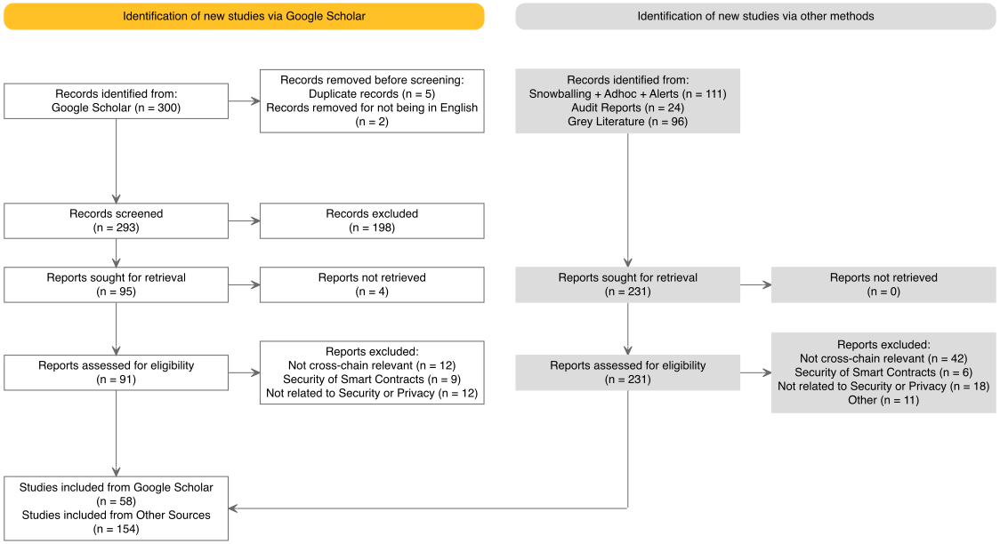

  

This folder contains key visual representations related to our study. It includes 'Systematic Literature Review', 'Papers Years Distribution', 'Timeline of Cross-Chain Hacks', and 'Vulnerability-Attack-Mitigation Graph', each offering insightful data visualization crucial for understanding the evolution and impact of security incidents in the blockchain domain.
  

  <h3>Figure 1: Systematic Literature Review</h3>
  

  <h3>Figure 2: Papers Years Distribution</h3>
  

  <h3>Figure 3: Timeline of Cross-Chain Hacks</h3>
  

  <h3>Figure 4: Vulnerability-Attack-Mitigation Graph</h3>
  

